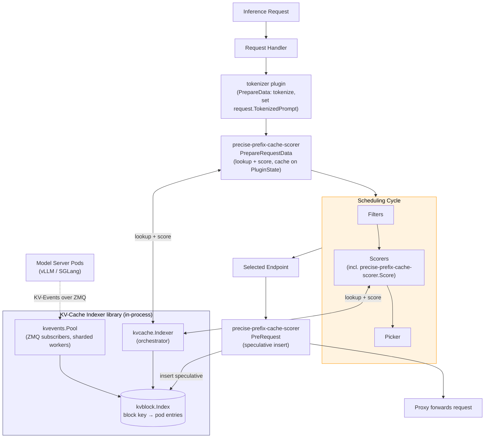
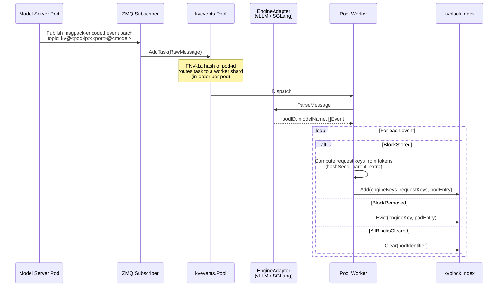
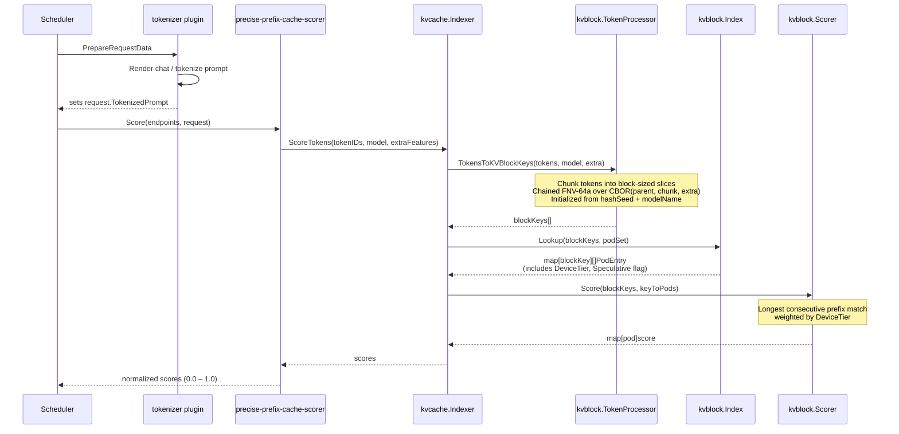
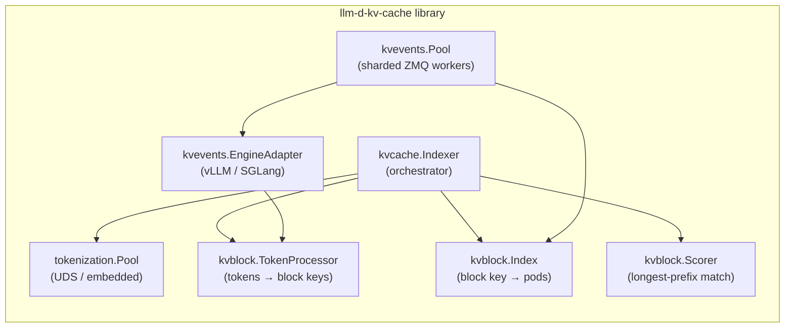

# KV-Cache Indexer

The **KV-Cache Indexer** enables llm-d's precise prefix-cache-aware scheduling functionality.

> [!NOTE]
> This page assumes familiarity with the EPP's design. See [EPP architecture](../core/epp) for more details.

## Functionality

The kv-cache indexer subscribes to `KVEvents` emitted from model servers to maintain a near realtime view of the KV cache state. The `precise-prefix-cache-scorer` uses this information during the EPP scheduler's filter -> score -> pick flow.

The precise view offers improved precision for harder-to-approximate scenarios:
- **Multi-Modal Models** — Multi-modal content hashes (images, audio) are folded into block keys, so two prompts with the same text but different images produce different keys and are routed to the pod with matching multimodal KV-cache.
- **Hybrid-Attention Models** — In hybrid models, KV cache usage per layer groups (full, sliding-window, linear) scales non-linearly making byte-based trees imprecise.
- **Advanced KV-Cache Orchestration** — As model-server KV-cache management policies grow beyond simple LRU, approximate views become increasingly unreliable and complex to create; the event-driven view tracks the actual state.

> [!NOTE]
> Hybrid-attention-aware scoring is a work in progress.

## Design - EPP Integration Overview

The indexer is deployed as a library, loaded into the EPP process. Two cooperating plugins are used by the scheduler:
* `tokenizer` — a `PrepareData` plugin that tokenizes the prompt (and any MM features) once and writes the result onto `LLMRequest.TokenizedPrompt` for downstream reuse.
* `precise-prefix-cache-scorer` — implements three EPP extension points: `PrepareRequestData`, `Score`, and `PreRequest`.



With speculative indexing enabled (recommended) — the three extension points carry the following responsibilities:
1. **`PrepareRequestData`** — reads `request.TokenizedPrompt`, computes block keys, looks up the index, and scores all candidate pods. Results are cached on `PluginState` for reuse later in the cycle, and a `PrefixCacheMatchInfo` is attached to each endpoint so downstream filters and scorers can see the match length.
2. **`Score`** — reads the pre-computed scores from `PluginState` and returns them normalized to `[0.0, 1.0]` for the scheduler.
3. **`PreRequest`** — fires after the scheduler picks an endpoint. Inserts speculative entries in the index for the selected pod (and, under P/D disaggregation, the selected prefill pod) with a TTL (default `2s`), closing the window before the confirming KV-event arrives.

> [!NOTE]
> With `speculativeIndexing: false`, `PrepareRequestData` and `PreRequest` 
> become no-ops and `Score` performs the full lookup-and-score itself on each
> request. The plugin no longer seeds the index between the routing decision
> and the confirming KV-event, so back-to-back identical prompts can race
> onto different pods until the engine's events land.

## Design - Write Path: Ingesting KV-Events

vLLM and SGLang publish three event types over ZMQ whenever their KV-cache state changes:
* **`BlockStored`** — blocks with the given content hashes have been created on a specific device tier. Payload includes the chained parent hash, the token chunk, any LoRA ID/name, and any multimodal extra keys.
* **`BlockRemoved`** — blocks with the given hashes have been evicted from a specific device tier and/or attention group.
* **`AllBlocksCleared`** — the pod dropped its entire cache (a reset). This can occur in RL weights rollouts and other scenarios. The indexer drops all entries associated with the pod via a reverse `pod → request keys` index.



**The dual-key design.** Model servers publish events using *engine keys* — hash identifiers derived from each engine's internal content-addressing. The indexer needs to look blocks up by hashes it can compute from the request's own prompt tokens (*request keys*). On each `BlockStored`, the worker computes the request key locally and stores a mapping `engineKey → requestKey` alongside `requestKey → PodEntry`. At read time the scorer looks up by request key only; the engine-key mapping is used during eviction so that a `BlockRemoved` referencing an engine key can find the corresponding request key.

### Event Delivery Modes

Two shapes are supported for getting events from the model servers to the indexer:

* **Centralized** — every model-server pod connects (`zmq.PUB`) to a single endpoint hosted by the EPP (`zmq.SUB`). Works naturally with a single EPP replica.

```
  Model Server A ──► ZMQ ──┐
  Model Server B ──► ZMQ ──┼──► EPP (binds tcp://*:5557)
  Model Server C ──► ZMQ ──┘
```

* **Pod discovery** — each model-server pod binds its own ZMQ socket. The EPP discovers pods via Kubernetes label selectors and creates per-pod subscribers. This is the mode to use for active-active multi-scheduler: every EPP replica independently subscribes to every pod and sees the full event stream.

```
  EPP Replica 1 ──ZMQ──┐
                       ├──► Model Server A (binds :5557)
  EPP Replica 2 ──ZMQ──┤
                       ├──► Model Server B (binds :5557)
  EPP Replica 1 ──ZMQ──┤
                       └──► Model Server C (binds :5557)
  EPP Replica 2 ──ZMQ──┘
```

> [!NOTE]
> In the current implementation, the plugin establishes subscribers lazily during `Score()`
> and maintains a 10-minute TTL cache of known endpoints, tearing down subscribers as endpoints
> fall out. The IGW data layer already exposes an endpoint source; wiring the plugin's
> subscriber management onto it — so subscriptions follow endpoint events directly rather
> than request-driven scoring — is in progress.

### Block Index Backends

The block index is the hot data structure of the system: every scoring call queries it, every KV-event updates it.

The KV-Indexer offer multiple backends, which can be configured depending on your desired memory and replication model:

| Backend                 | Storage                                                                         | When to use                                                                                                                                                                | Tradeoff                                                                                                                                                       |
|:------------------------|:--------------------------------------------------------------------------------|:---------------------------------------------------------------------------------------------------------------------------------------------------------------------------|:---------------------------------------------------------------------------------------------------------------------------------------------------------------|
| **In-Memory (default)** | Two-level LRU: outer cache keyed by block hash, inner cache of pods per block   | Default choice for most deployments                                                                                                                                        | Lowest latency; fixed entry count (default 100M keys × 10 pod entries) makes sizing predictable                                                                |
| **Cost-Aware Memory**   | Ristretto cache with admission control and cost-based eviction                  | Workloads where per-entry size varies a lot (multimodal, variable-length LoRA metadata)                                                                                    | Budget specified in bytes (e.g. `2GiB`) rather than entry count; probabilistic admission can reject entries under pressure                                     |
| **Redis / Valkey**      | External server (TCP; Valkey is Redis-wire-compatible, BSD-licensed)            | Need for persistent or very-long lived index (uncommon)                                                                                                                    | Adds a network hop per lookup and ties EPP availability to the external store; shared state gives strong consistency across replicas but is rarely necessary   |

> [!IMPORTANT]
> In-memory is typically the best option, offering low-latency, simple operations, 
> and high availability via multi-replica deployment (as each EPP replica in pod-discovery
> mode subscribes to every model server events independently and converges to the
> same index).

**Sizing Notes**: In-memory backends size independently per replica; plan for roughly `keys × pod_entries` with overhead for the two-level LRU. The cost-aware backend is easier to bound because you specify a byte ceiling; it is the safer choice when per-entry size is hard to predict. For Redis / Valkey, the key space is proportional to unique blocks across the fleet, not to request volume.

## Design - Read Path: Scoring a Request

The scorer's goal is to find the length of the **longest consecutive prefix** of the request's block sequence cached in each candidate pod.



KV-cache blocks form a chain where block `i` depends on all blocks `0..i-1`. Due to the causal nature of attention, a server can reuse a cached block only if it holds the unbroken prefix leading up to it.

For example, consider a prompt with block keys `[B0, B1, B2, B3, B4]` and three candidate pods:

```
Block keys:   B0    B1    B2    B3    B4

Pod A:        yes   yes   yes   yes   no    → score = 4.0 (4 blocks)
Pod B:        yes   yes   no    -     -     → score = 2.0 (2 blocks, chain breaks at B2)
Pod C:        no    -     -     -     -     → score = 0.0 (no prefix)
```

Even if Pod C happened to hold `B3` and `B4`, those entries are unusable without the preceding chain, and the score is zero.

When blocks are stored across memory tiers, each matching block's contribution is weighted by tier. For a block cached on multiple tiers at once, the scorer takes the maximum weight. Defaults are `gpu = 1.0`, `cpu = 0.8`.

Raw scores are then normalized to `[0.0, 1.0]` before being returned to the scheduler, where they are combined with other scorers (queue depth, KV-cache utilization, etc.) through the standard Filter-Score-Pick pipeline.

### Speculative Indexing

Confirmed KV-events arrive after a request has been routed. Back-to-back requests with the same prefix can be scheduled before `KVEvents` are propagated, breaking affinity.

Speculative indexing solves this challenge (`speculativeIndexing: true`):
1. During `PrepareRequestData`, the block keys for the incoming request are computed and cached on `PluginState`.
2. During `PreRequest` — *after* the scheduler picks an endpoint — the plugin inserts speculative entries for each block key at the chosen pod (and, under P/D disaggregation, the chosen prefill pod).
3. Speculative entries carry a `Speculative: true` flag. They participate in scoring exactly like confirmed entries.
4. Each request's speculative entries are registered in a TTL cache (default `2s`). On expiry, if no confirming `BlockStored` has arrived, the entries are evicted.

The default 2-second TTL is tuned to comfortably exceed the typical routing-to-event latency without outliving a genuinely failed speculation.

### Multimodal, LoRA, and Hybrid Attention

Many deployment patterns cache KV blocks based on more than text. The KV-Indexer supports these additional modalities.
* **Multimodal** - The indexer folds per-block multimodal content hashes into the block-key chain. vLLM emits an `extra_keys` field on `BlockStored` events (bare multimodal hash strings in v0.18+, legacy `[hash, offset]` tuples before), which the adapter parses into `BlockExtraFeatures`. The same feature is computed on the read side by walking the multimodal placeholders in the tokenized prompt. Two prompts identical in text but differing in image content hash differently and route independently.
* **LoRA** - On `BlockStored`, if a `LoraName` is present, the indexer uses it in place of the base model name when deriving block keys. Different adapters therefore produce different key chains for the same token sequence, and cache hits are correctly scoped to the adapter.
* **Hybrid attention** - vLLM partitions the KV-cache of a hybrid model into layer groups — full attention, sliding-window attention, linear/state-space — that evict independently. For a single token range, the full-attention blocks can still be resident while the SWA blocks have rolled out of the attention window, and the same "prefix" is cached in one group but not in another. Scoring for hybrid models therefore classifies each prefix match as **full** (all groups present), **partial** (some groups retained, others evicted outside the window in a way the model can tolerate), or **miss**, and the scorer needs the model's window sizes to decide whether a partial hit is still routable.

## Internal Modules



| Module                   | Role                                                                                                                                                                                          |
|:-------------------------|:----------------------------------------------------------------------------------------------------------------------------------------------------------------------------------------------|
| `kvcache.Indexer`        | Entry point for the plugin. Coordinates block-key computation, index lookup, and scoring.                                                                                                     |
| `kvblock.TokenProcessor` | Converts a token sequence into a deterministic list of block keys. Reproduces the engine's chained FNV-64a over CBOR content-addressing scheme.                                               |
| `tokenization.Pool`      | Worker pool for rendering and tokenizing prompts. Sources tokenizers from a UDS sidecar, from local files, or from HuggingFace Hub. If tokenization is external, this module is not required. |
| `kvblock.Scorer`         | Computes per-pod scores from a list of block keys and lookup results. Currently implements longest consecutive prefix match, weighted by device tier.                                         |
| `kvblock.Index`          | The block index itself. A pluggable interface (see [backends](#block-index-backends)) storing `blockKey → []PodEntry` plus the auxiliary `engineKey → requestKey` map.                        |
| `kvevents.Pool`          | Sharded worker pool that consumes ZMQ messages, orders them per-pod (FNV-1a on pod ID), and applies them to the index.                                                                        |
| `kvevents.EngineAdapter` | Parses engine-specific wire formats into domain events. vLLM (msgpack) and SGLang (msgpack) adapters ship today.                                                                              |

## Configuration

The indexer is configured as parameters of the `precise-prefix-cache-scorer` plugin in the EPP's `EndpointPickerConfig`. The top-level shape is three sub-configs:

```yaml
- type: precise-prefix-cache-scorer
  parameters:
    tokenProcessorConfig: { ... }
    indexerConfig: { ... }
    kvEventsConfig: { ... }
    speculativeIndexing: true      
    speculativeTTL: "2s"           
```

### Plugin

Top-level parameters of the `precise-prefix-cache-scorer` plugin.

| Field | Type | Default | Description |
| :--- | :--- | :--- | :--- |
| `tokenProcessorConfig` | object | — | Token-to-block-key config (see below). |
| `indexerConfig` | object | — | Indexer config: tokenizer sourcing, index backend, device tiers. |
| `kvEventsConfig` | object | — | KV-events subscription config. |
| `speculativeIndexing` | boolean | `false` | If `true`, proactively insert speculative entries after a routing decision to close the window before the confirming KV-event. Enables the `PrepareRequestData` / `PreRequest` flow. |
| `speculativeTTL` | string (duration) | `"2s"` | TTL for speculative entries. Parsed as a Go duration (e.g. `"2s"`, `"500ms"`). Only applies when `speculativeIndexing: true`. |

### Token Processor

| Field       | Type    | Default | Description                        |
|:------------|:--------|:--------|:-----------------------------------|
| `blockSize` | integer | `16`    | Tokens per KV-block. **Must match** the model server's `--block-size` flag. |
| `hashSeed`  | string  | `""`    | Seed for the initial FNV-64a hash. **Must align** with `PYTHONHASHSEED` on model server pods. |

### Indexer

| Field | Type | Default | Description |
| :--- | :--- | :--- | :--- |
| `tokenizersPoolConfig.modelName` | string | — | Required. Model name for tokenization (e.g. `Qwen/Qwen3-32B`). |
| `tokenizersPoolConfig.workersCount` | integer | `5` | Tokenization worker goroutines. |
| `tokenizersPoolConfig.uds.socketFile` | string | — | UDS tokenizer socket path. Recommended for production. |
| `tokenizersPoolConfig.hf.enabled` | boolean | `true` | Download tokenizers from HuggingFace Hub as a fallback. |
| `tokenizersPoolConfig.hf.huggingFaceToken` | string | `""` | Token for gated or private models. Auto-populated from `HF_TOKEN` env var if set. |
| `tokenizersPoolConfig.local.autoDiscoveryDir` | string | `/mnt/models` | Directory to scan for local `tokenizer.json` files. |
| `kvBlockIndexConfig` | object | — | Index backend config (see below). |
| `kvCacheBackendConfigs[].name` | string | — | Device tier name (`gpu`, `cpu`, …). |
| `kvCacheBackendConfigs[].weight` | float | — | Scoring weight for this tier. Defaults to `gpu=1.0`, `cpu=0.8`. |

### Index Backend (`kvBlockIndexConfig`)

Configure exactly one of the following. If more than one is set, the first resolved takes effect.

**In-Memory:**

| Field | Type | Default | Description |
| :--- | :--- | :--- | :--- |
| `inMemoryConfig.size` | integer | `100000000` | Max block keys retained. |
| `inMemoryConfig.podCacheSize` | integer | `10` | Max pods tracked per block key. |

**Cost-Aware Memory:**

| Field | Type | Default | Description |
| :--- | :--- | :--- | :--- |
| `costAwareMemoryConfig.size` | string | `2GiB` | Memory budget (`500MiB`, `2GiB`, …). |

**Redis / Valkey:**

| Field | Type | Default | Description |
| :--- | :--- | :--- | :--- |
| `redisConfig.address` | string | `redis://127.0.0.1:6379` | Connection URL. Supports `redis://`, `valkey://`, `valkeys://`. |
| `redisConfig.backendType` | string | `redis` | `redis` or `valkey`. |
| `redisConfig.enableRDMA` | boolean | `false` | Enable RDMA transport. Experimental — requires a Valkey build with RDMA support. |

### KV-Events (`kvEventsConfig`)

| Field | Type | Default | Description |
| :--- | :--- | :--- | :--- |
| `zmqEndpoint` | string | `""` | Local ZMQ socket to bind (e.g. `tcp://*:5557`). Used in centralized mode and as a "local subscriber" alongside pod discovery. |
| `topicFilter` | string | `kv@` | ZMQ topic prefix filter. |
| `concurrency` | integer | `4` | Parallel event-processing workers. |
| `engineType` | string | `vllm` | `vllm` or `sglang`. |
| `discoverPods` | boolean | `true` | Enable Kubernetes pod discovery (per-pod subscriber creation). |
| `podDiscoveryConfig.podLabelSelector` | string | `llm-d.ai/inference-serving=true` | Label selector for model-server pods. Matches the label set by the llm-d guides. |
| `podDiscoveryConfig.podNamespace` | string | `""` | Namespace to watch. Empty watches all (requires cluster-wide RBAC). |
| `podDiscoveryConfig.socketPort` | integer | `5557` | Port exposed by each model-server pod for its ZMQ socket. |

### Model Servers

Model servers must be configured to publish KV-Events over ZMQ with a topic of the form `kv@<pod-ip>:<port>@<model>`.

For vLLM concretely:

- `PYTHONHASHSEED` **must be set** and align with the indexer's `tokenProcessorConfig.hashSeed`.
- `--block-size` **must match** the indexer's `tokenProcessorConfig.blockSize`.
- `--kv-events-config` must enable ZMQ publishing with topic `kv@<pod-ip>:<port>@<model>`.

SGLang uses equivalent configuration; see its KV-events documentation.

### Tokenizer Sources

The `tokenizer` plugin (and the indexer's own internal tokenization pool) can source tokenizers three ways:
* **UDS sidecar (recommended for production).** A tokenizer sidecar container serves tokenization requests over a Unix domain socket (default `/tmp/tokenizer/tokenizer-uds.socket`). The sidecar resolves the model identifier as a local path if the path exists on disk, and otherwise downloads and caches from HuggingFace (or ModelScope) on first use. Shared between the `tokenizer` plugin and the indexer.
* **In-process local files.** The indexer's embedded tokenizer scans a directory (default `/mnt/models`) for `tokenizer.json`, supporting both HuggingFace cache layouts (`models--org--model/snapshots/{hash}/tokenizer.json`) and flat layouts.
* **In-process HuggingFace Hub.** The indexer's embedded tokenizer downloads on demand. Convenient for development; adds startup latency.

The plugin falls back through these in order.

## Examples

### EPP Plugin Configuration

```yaml
apiVersion: inference.networking.x-k8s.io/v1alpha1
kind: EndpointPickerConfig
plugins:
  - type: single-profile-handler
  - type: tokenizer
    parameters:
      modelName: Qwen/Qwen3-32B
      udsTokenizerConfig:
        socketFile: /tmp/tokenizer/tokenizer-uds.socket
  - type: precise-prefix-cache-scorer
    parameters:
      tokenProcessorConfig:
        blockSize: 16
      indexerConfig:
        tokenizersPoolConfig:
          modelName: Qwen/Qwen3-32B
          local: null
          hf: null
          uds:
            socketFile: /tmp/tokenizer/tokenizer-uds.socket
      kvEventsConfig:
        topicFilter: "kv@"
        concurrency: 4
        discoverPods: false
        zmqEndpoint: "tcp://*:5557"
      speculativeIndexing: true
  - type: kv-cache-utilization-scorer
  - type: queue-scorer
  - type: max-score-picker
schedulingProfiles:
  - name: default
    plugins:
      - pluginRef: precise-prefix-cache-scorer
        weight: 3.0
      - pluginRef: kv-cache-utilization-scorer
        weight: 2.0
      - pluginRef: queue-scorer
        weight: 2.0
      - pluginRef: max-score-picker
```

The weighting reflects the cost of a cache miss: a matched prefix avoids prefill entirely, so `precise-prefix-cache-scorer` is weighted above utilization-level signals.

### Model Server with KV-Events (Centralized, vLLM example)

```yaml
args:
  - "--block-size=16"
  - "--kv-events-config"
  - |-
    {
      "enable_kv_cache_events": true,
      "publisher": "zmq",
      "endpoint": "tcp://<epp-service>.<namespace>.svc.cluster.local:5557",
      "topic": "kv@$(POD_IP):8000@Qwen/Qwen3-32B"
    }
```

### Pod-Discovery Mode (Active-Active Schedulers)

EPP side:

```yaml
kvEventsConfig:
  topicFilter: "kv@"
  concurrency: 4
  discoverPods: true
```

Model-server side — each pod binds its own socket (vLLM example):

```json
{
  "enable_kv_cache_events": true,
  "publisher": "zmq",
  "endpoint": "tcp://*:5557",
  "topic": "kv@<pod-ip>:<pod-port>@<model-name>"
}
```
